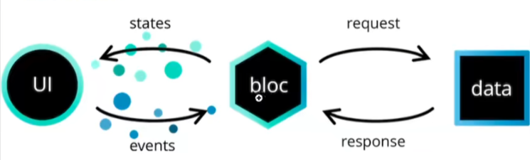

# 简介

`bloc`将页面、逻辑和数据进行分离，有点类似于MVP架构。MVP的架构主要缺陷就是类(文件)太多，虽然我们也可以用插件，但插件要跟随`API`变更，就像6~8有大的`API`变更，但插件并没有同步，所以创建的文件可以理解为废代码，what's the fuck???，所以好的架构还是应该面向接口编程，实现随你改，但不要改`API`啊。

# 概念

## Cubit

`bloc extends cubit`，是一种特殊的数据流，

