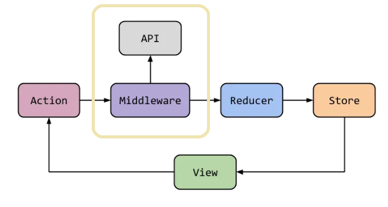

# 简介

`Redux`在React/vue中的控件，与Flutter和dart概念一致，主要由三部分组成

```
Store：数据仓库，支持存储State对象，管理应用状态
Reducer(纯函数)：处理和事件分发，一般用户接收事件后处理数据，并将结果转为业务需要的数据返回
Action：事件，用于分发到对应的Reducer类
```



```
1. 产生一个Action
2. Redux将Action派发到对应的Reducer
3. Reducer根据action做对应的数据获取、处理， 然后将处理后的数据转给Store存储
4. Store收到信的数据(状态)后通知监听者更新
```

## 类

```
StoreProvider：用于整个App顶层，提供给所有Widget所有的Store
StoreBuilder：接受事件
StoreConnector：可用来替代StoreBuilder，能够将Store转为ViewModel
```


# 使用

包依赖

```yaml
dependencies:
  flutter:
    sdk: flutter

  redux: 5.0.0
  flutter_redux: 0.10.0
```

目录结构

```yaml
.lib
	redux
		actions
			count_action.dart #技术的事件
			other_action.dart # 文本事件
		reducers
			count_reducer.dart #过滤事件并生成新状态
			other_recucer.dart #过滤文本变更状态
		states
			count_state.dart # 绑定状态
			other_state.dart # 绑定状态
			app_state.dart #集合管理状态
		store
			my_store.dart #申明绑定关系
	main.dart  --程序入口
```

## state

### count_state

```dart
// 有一个数字的状态
class CountState{
  final int count;
  CountState(this.count);
}
```

### other_state

```dart
// 文本状态
class OtherState{
  String? title;

  OtherState(this.title);
}
```

### app_state

用来持有所有的状态

```dart
class AppState{
  final OtherState otherState;
  final CountState countState;

  AppState(this.otherState, this.countState);
}
```

## action

申明接收的事件

### Count_action

```dart
class CountAction{
  final int value;
  CountAction(this.value);
}

class IncrementAction{}
class ReduceAction{}
```

### other_action

```dart
class OtherAction{
  final String value;
  OtherAction(this.value);
}
```

## reducer

将原有的事件包装成为新的状态返回。状态管理都是新的状态

### count_reducer

```dart
final countReducer = combineReducers<CountState>(
  [
    TypedReducer<CountState,IncrementAction>(_add),
    TypedReducer<CountState,ReduceAction>(_reduce),
    TypedReducer<CountState,CountAction>(_init),
  ]
);

CountState _add(state,action) => CountState(state.count+1);
CountState _reduce(state,action) => CountState(state.count-1);
CountState _init(state,CountAction action) => CountState(state.value);
```

### other_reducer

```dart
OtherState otherReducer(state,action){
  switch(action.runtimeType){
    case OtherAction:
      return OtherState((action as OtherAction).value);
    default:
      return state;
  }
}
```

## store

建立state/action/reducer的绑定关系

```dart
final store = Store<AppState>((AppState state,action){
  return AppState(otherReducer(state.otherState,action),countReducer(state.countState,action));
},initialState: AppState(
    OtherState(null),
    CountState(0)
));
```

## 页面申明

在页面中使用

```dart
class MainReduxPage extends StatelessWidget {
  const MainReduxPage({Key? key}) : super(key: key);

  @override
  Widget build(BuildContext context) {
    return Scaffold(
      body: StoreConnector<AppState,CountState>(
        converter: (store){
          return store.state.countState;
        },
        builder: (context,state){
          return Text("${state.count}");
        },
      ),

      floatingActionButton: StoreBuilder<AppState>(
        builder: (context,store){
          return Row(
            children: [
              FloatingActionButton(
                onPressed: () => store.dispatch(IncrementAction()),
                tooltip: 'Increment',
                child: Icon(Icons.add),
                heroTag: 'Increment',
              ),
              FloatingActionButton(
                onPressed: () => store.dispatch(ReduceAction()),
                tooltip: 'Decrement',
                child: Icon(Icons.close),
                heroTag: 'Decrement',
              ),
            ],
          );
        },
      ),
    );
  }
}
```

## 入口

redux要求统一主入口

```da
 runApp(StoreProvider(store: store, child: const MyApp()));
```


# 建议

在`Flutter`中官方建议：

1. 如果只是局部使用，不涉及到跨widget/page共享，那么最好不要使用Redux

2. redux只放全局共享数据(毕竟是大对象)