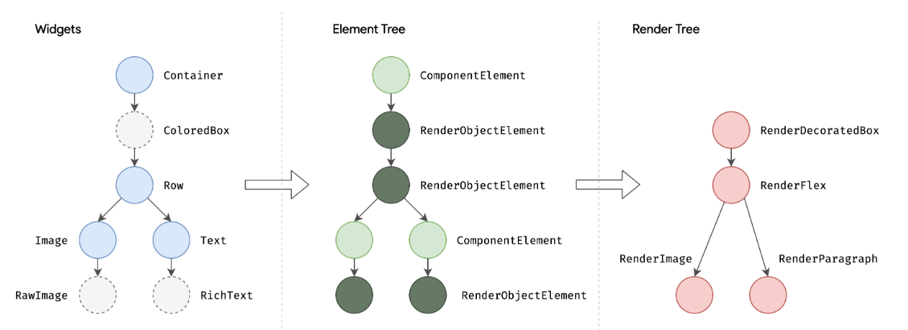

# StatelessWidget

```dart
class A extends StatelessWidget{
    /* 省略构造函数 */
    Widget build(BuildContext context){
        return Container("伪代码：布局")
    }
}
```

对于`StatelessWidget`的组件树来说，一旦内部数据发生变更，整个组件都要重新创建和渲染该对象`A()`。

# StatefulWidget

状态：指的是`State`内部的属性，

```dart
class B extends StatefulWidget{
    /* 省略构造函数 */
    _BState createState() => _BState();
}

class _BState extends State<B>{
    int _count = 0;
    
    void changeSomeThing(){
        setState((){
            _count++;
        })
    }
    
    Widget build(BuildContext context){
        return Container("伪代码：布局");
    }
}
```

对于`StatefulWidget`来说，里面数据发生了变更，它只会去重新调用`B.state.build()`方法，而不会重新创建组件，所以`B.state`里面的属性都还在，也就意味着状态得到了保存。

## 状态管理

对于一个`StatefulWidget`来说，状态值该的管理一般有三种策略。widget自身管理、widget管理子Widget状态、混合管理(父Widget和子Widget一起管理)。

### 自身管理

如上面代码所示

### 父Widget管理子Widget

父Widget通过`setState`触发子Widget重新刷新来控制子Widget，子Widget通过回调函数来通知父Widget做更新。

```dart
// 父Widget代码
class ParentWidget extends StatefulWidget{
    _ParentWidgetState createState() => _ParentWidgetState();
}

class _ParentWidgetState extends State<ParentWidget>{
    bool _active = false;
    
    void handleTapChanged(bool newVlue){
        setState((){
            _active = newValue;
        })
    }
    
    Widget build(BuildContext context){
        return Container(
        	child:TapBoxB(
            	active:_active,
                onChanged: handleTapChanged
            )
        );
    }
}
```

```dart
// 子Widget代码
class ChildWidget extends StatelessWidget{
    ChildWidget({Key?key,this.active:false,required this.onChanged}):super(key:key);
    
    final bool active;
    final ValueChanged<bool> onChanged;
    
    void _handleTap(){
        onChanged(!active);
    }
    
    Widget build(BuildContext context){
        return GestureDetector(
        	onTap:_handleTap,
            child: Container(
            	child:Text(active? 'Active':'Inactive')
            )
        );
    }
}
```

### 混合管理

一般来说：对于只和自己相关的数据自己控制，和父控件相关的交由父容器控制。比如以下案例：由父容器控制是否显示，子容器控制是否显示边框

```dart
// 父容器
class ParentWidgetC extends StatefulWidget{
    _ParentWidgetCState createState() => _ParentWidgetCState();
}

class _ParentWidgetCState extends State<ParenetWidgetC>{
    bool _active = false;
    
    void handleTapChanged(bool newValue){
        setState((){
            _active = newValue;
        })
    }
    
    Widget build(BuildContext context){
        return Container(
        	child: ChildWidget(
            	active: _active,
                onChanged: handleTapChanged
            )
        );
    }
}
```

```dart
// 子容器控制：因为要控制状态，所以要申明为StatefulWidget
class ChildWidget extends StatefulWidget{
    ChildWidget({Key?key,this.active:false,required this.onChanged}):super(key:key);
    
    final bool active;
    final ValueChanged<bool> onChanged;
    
    _ChildWidgetState createState() => _ChildWidgetState();
}

class _ChildWidgetState extends State<ChildWidget>{
    bool _hightlight = false;
    void handleTapDown(TapDownDetails details){
        setState((){
            _hightlight = true;
        })
    }
    void handleTapUp(TapDownDetails details){
        setState((){
            _hightlight = false;
        })
    }
    void handleTapCancel(TapDownDetails details){
        setState((){
            _hightlight = false;
        })
    }
    void hangdeTap(){
        widget.onChanged(!widget.active);
    }
    
    Widget build(BuildContext context){
        return GestureDetector(
        	onTapDown: _handleTapDown,
            onTapUp: _handleTapUp,
            onTap:_hangleTap,
            onTapCancel: _hangdleTapCancel,
            ...
        );
    }
}
```


## 生命周期


`InheritedWidget`那些虚线框中的是只有引入了`InheritedWidget`触发了更新才会调用的。`setState`和`didUpdateWidget`都会触发`StatefulWidget`的`build`方法，实际上，页面重启和父组件调用`setState`都会触发`didUpdateWidget`重绘。


# 渲染原理

`Flutter`中的Widget并不是直接绘制在屏幕上的元素，而是根据widget转换，最终可渲染对象。当`Widget`属性发生变更的时候系统会创建新的，并替换原有的`Widget`，同时会触发创建新的Element`，并将新的插入到`Element Tree`中。



```
1. 根据Widget树生成Element树。Element树节点都继承自Element类
2. 根据Element树生成Render树（渲染树），渲染树节点都继承自RenderObject类
3. 根据渲染树生成Layer树，这个树是可以直接在屏幕上显示的。Layer中的节点全部继承自Layer类
```

# 代码逻辑

```dart
@immutable
abstract class Widget extends DiagnosticableTree{
    // 控件独有：用来判断组件该创建还是更新，会在canUpdate中使用
    final Key? key;
    
    @protected
    @factory
    Element createElement()
}
```

```dart
// StatelessWidget源码：伪代码
abstract class StatelessWidget extends Widget{
    /* 构造函数 */
    StatelessElement createElement => StatelessElement(this);
}
```

```dart
// StatefulWidget
abstract class StatefulWidget extends Widget{
    /* 构造函数 */
    StatefulElement createElement() => StatefulElement(this);
    
    State createState();
}
```

从上面代码可以看出，`State`是单独维护的，所以不会出现组件`build`之后`State`还保留着。


# InheritedWidget
在Flutter的开发过程当中，一个Widget的状态通常是保存在自己的内部的，这意味着它们对状态的修改都只局限于在自己内部，也就是说每个`Widget`中维护的只是一个复本。所以无法做到组件之间的访问、共享状态。比如现在开发一个电商首页的购物车模块，我们对购物车内的每条商品的展示进行了封装，比如叫`GoodsItemWidget`，我们期望使用这个组件进行增加、删除的时候，底部总加购数量会跟着改变，这时候使用`setState`就不那么容易做到了。更别说跨页面消息传递了，比如用户登录之后刷新购物车、消息等功能了。
而`InheritedWidget`的出现就是为了解决这个问题，它允许在Widget树中共享数据，也就是可以多个Widget之间共享数据。它设计的准则是当`InheritedWidget`中的数据发生变化的时候，会通知其他的依赖项。

## demo

创建`InheritedWidget`的实现类

```dart
class CountState extends InheritedWidget {

  final int count;
  final Widget child;
  final VoidCallback addCounter;  //VoidCallback等同于 void Function()
  final VoidCallback removeCounter;

  const CountState({
    Key? key,required this.count,required this.child,required this.addCounter,required this.removeCounter}) : super(key: key, child: child);

  // 通用获取实例声明
  static CountState of(BuildContext context) {
    final CountState? result = context.dependOnInheritedWidgetOfExactType<CountState>();
    return result!;
  }

  // 用来控制是否需要通知
  @override
  bool updateShouldNotify(CountState oldWidget) {
    return count != oldWidget.count;
  }
}

```

创建页面

```dart
class RootWidget extends StatefulWidget{}

class _RootWidgetState extends State<RootWidget>{
    int count = 0;
	
    void addCounter() {
    	setState(() {
      		count++;
    	});
  	}

  	void removeCounter() {
    	setState(() {
      		count--;
    	});
  	}
    
    Widget build(BuildContext context){
        return CountState(
        	count: count,
            addCounter: addCounter,
            removeCounter: removeCounter,
            child: ChildWidget()
        );
    }
}

// 具体UI界面:省略各种样式配置等
class ChildWidget extends StatelessWidget{
    Widget build(BuildContext context){
        final counterState = Counter.of(context);
        return Scaffold(
        	column(
            	children:<Widget>[
                    Text('${counterState.count}'),
                    Row(
                    	FloatingActionButton(onPressed:counterState.addCounter);
                        FloatingActionButton(onPressed:counterState.removeCounter);
                    )
                ]
            )
        );
    }
}
```


