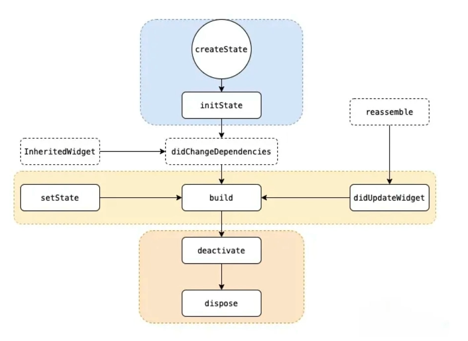

# StatelessWidget

```dart
class A extends StatelessWidget{
    /* 省略构造函数 */
    Widget build(BuildContext context){
        return Container("伪代码：布局")
    }
}
```

对于`StatelessWidget`的组件树来说，一旦内部数据发生变更，整个组件都要重新创建和渲染该对象`A()`。

# StatefulWidget

状态：指的是`State`内部的属性，

```dart
class B extends StatefulWidget{
    /* 省略构造函数 */
    _BState createState() => _BState();
}

class _BState extends State<B>{
    int _count = 0;
    
    void changeSomeThing(){
        setState((){
            _count++;
        })
    }
    
    Widget build(BuildContext context){
        return Container("伪代码：布局");
    }
}
```

对于`StatefulWidget`来说，里面数据发生了变更，它只会去重新调用`B.state.build()`方法，而不会重新创建组件，所以`B.state`里面的属性都还在，也就意味着状态得到了保存。

## 生命周期


`InheritedWidget`那些虚线框中的是只有引入了`InheritedWidget`触发了更新才会调用的。`setState`和`didUpdateWidget`都会触发`StatefulWidget`的`build`方法，实际上，页面重启和父组件调用`setState`都会触发`didUpdateWidget`重绘。


# InheritedWidget
在Flutter的开发过程当中，一个Widget的状态通常是保存在自己的内部的，这意味着它们对状态的修改都只局限于在自己内部，也就是说每个`Widget`中维护的只是一个复本。所以无法做到组件之间的访问、共享状态。比如现在开发一个电商首页的购物车模块，我们对购物车内的每条商品的展示进行了封装，比如叫`GoodsItemWidget`，我们期望使用这个组件进行增加、删除的时候，底部总加购数量会跟着改变，这时候使用`setState`就不那么容易做到了。更别说跨页面消息传递了，比如用户登录之后刷新购物车、消息等功能了。
而`InheritedWidget`的出现就是为了解决这个问题，它允许在Widget树中共享数据，也就是可以多个Widget之间共享数据。它设计的准则是当`InheritedWidget`中的数据发生变化的时候，会通知其他的依赖项。


