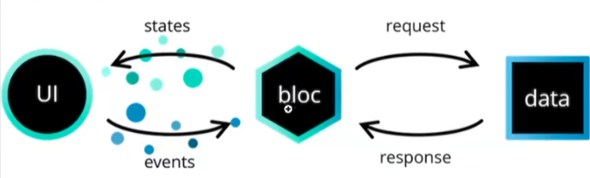
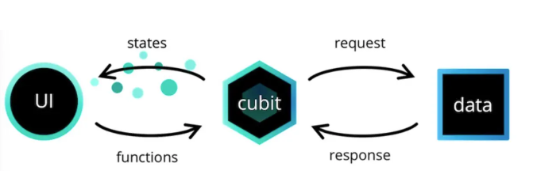

# 简介



bloc处理逻辑

```
1. widget触发event事件
2. bloc接收event事件并作出逻辑处理
3. 逻辑处理完返回出来
4. UI刷新数据
```

最新版本的`BLoc`中，额外提供了一个`Cubit`的类来管理状态，它和`Bloc`一样都继承自`BlocBase`。`bloc架构`将页面、逻辑和数据进行分离，有点类似于MVP架构。MVP的架构主要缺陷就是类(文件)太多，虽然我们也可以用插件，但插件要跟随`API`变更，就像6~8有大的`API`变更，插件要同步更新，令人反感的是大版本会废弃`API`，所以有点麻烦。

# 概念

## Cubit

cubit主要通过函数触发`UI`变更



```dart
class CounterCubit extends Cubit<int>{  // 指明Cubit管理的状态类型
    CounterCubit() : super(0); // 构造函数，可以方便外部传入值
    
    /**
    	emit是保护函数，只能在Cubit内部使用
    	state是父属性，用于获取当前状态
    **/
    void increment() => emit(state +1); 
    
    /**
    	初始化的时候不会调用onChange方法
    	一个Change对象里包含currentState和nextState两个值，
    	这里需要注意，当两个状态的值一样时不会触发onChange（源码判断重复）
    **/
    @Override
    onChange(Change<int> change){
        super.onChange(change);
    }
}
```

不需要使用的时候可以通过实例调用`close`关闭

```dart
cubit.close();
```

## BLOC

bloc主要通过事件驱动，这也说明我们在使用的时候除了状态管理和初始值之外，还要考虑事件和事件的处理。


```dart
// 定义事件
class CounterPressed extends CounterEvent{}

class CounterBloc extends Bloc<CounterEvent,int>{
    CounterBloc() : super(0){
        // 注册事件
        on<CounterPressed>((event,emit){
            // 同Cubit一样，emit只能在Bloc内部使用
            emit(state + 1)
        })
    }
    
    /**
    	同Cubit解释
    **/
    @Override
    onChange(Change<int> change){
        super.onChange(change);
    }
}
```

使用

```dart
final bloc = CounterBloc();
// 事件触发，可以理解为发送事件
bloc.add(CounterPressed());
// 不用的时候需要调用关闭方法
await bloc.close();
```

## 区别

`Bloc`和`Cubit`最大的区别在于`Bloc的onTransition方法`，它会在`onChange`之前调用，用来记录每一次状态转变的详细，内部源码实现主要是将事件转换为状态。

```dart
@Override
void onTransiton(Transition<CounterEvent,int> transition){
	// 输出{currentState:0,event:CounterPressed,nextState:1}
	print(transation);
}
```

# BLoc Widget

BLoc Widget都有集成`Cubit`和`BLoc`，常用的有`BLocProvider`、`BlocBuilder`、`BlocSelector`、`BlocListener`、`BlocConsumer`。

## BlocProvider

```dart
BlocProvider(
	lazy:false,  //true为立马创建，false表示子集获取BlocPovider的时候再创建
    create:(BuildContext context) => BlocA(); // 在子集通过of创建Bloc的时候调用该方法
    child:ChildA(),
)
```

在`BlocProvider`内部使用，比如在`ChildA`立马获取`BlocProvider`对象。通过`BlocProvider.of<T>(context)`来获取。这种新式创建的`Bloc`会由`BlocProvider`来管理它的声明周期，是否回收，因为是它在管理。

在`BlocProvider`外部使用，比如另外的组件中可以使用`context.read<BlocA>()`来获取实例。这种情况下，`BlocProvider`不会自动关闭，因为它没有创建它，需要自己管理

### MultiBlocProvider

`MultiBlocProvider`可以将多个`BlocProvider`组合成为一个，不仅仅提高了可读性，也提高了多层嵌套

```dart
MultiBlocProvider(
	providers:[
        BlocProvider<BlocA>(
        	create: (BuildContext context) => BlocA()
        ),
        BlocProvider<BlocB>(
        	create: (BuildContext context) => BlocB()
        ),
        child:ChildA()
    ]
)
```

## BlocBuilder

`BlocBuilder`需要bloc和builder两个方法，`BlocBuilder`在接收新的状态时处理builder组件

```dart
BlocBuilder<BlocA,BlocAState>(
	bloc:blocA,
    builder:(context,state){
        // 状态变更回调
    },
    // 非必须实现方法
    buildWhen:(previousState,state){
        //返回true/false来控制使用新数据还是老数据重构组件，老数据不会重构数据
    }
)
```

## BlocSeletor

`BlocSeletor`是一个和`BlocBuilder`类似的组件，它允许开发者选择一个状态值来过滤更新，当这个值没有变化的时候，则会组织不必要的构建

```dart
BlocSelector<BlocA,BlocAState,SelectedState>(
	selector:(state){
        return state.parameterA;
    },
    builder:(context,state){
        
    }
)
```

## BlocListener

每次状态更新都会调用listener，和`BlocProvider`最大的不同在于，初始状态不会调用listener方法

```dart
BlocListener<BlocA,BlocAState>(
	bloc:blocA,
    listener:(context,state){
        //void函数：执行操作
    },
    child:...
)
```

## BlocConsumer

`BlocConsumer`公开一个`builder`和`listener`，有点像`BlocListener`和`BlocBuilder`的合集

```dart
BlocConsumer<BlocA,BlocAState>(
	listener:(context,state){
        // 状态改变
    },
    builder:(context,state){
        // 组装新的widget
    }
)
```


# 使用

## 依赖包

```yaml
dependencies:
	flutter_bloc: 8.0.0   #bloc不仅仅可以用在flutter
```

## 实现

### Bloc模式

一般用于复杂页面，因为生成的文件很多。

#### 生成文件

安装插件后右键创建`Bloc Class`，会生成3个文件，实际上我们会将对应页面也放在这个目录下。

```
main
	-main_bloc.dart  
	-main_event.dart 
	-main_state.dart
	-main_page.dart
```

#### main_event

申明有哪些事件，后面两个是我们定义的，继承自`MainEvent`，一个用于表示初始化调用，另一个表示递加的数据操作

```dart
@immutable
abstract class MainEvent{}

class InitEvent extends MainEvent{}
class AddEvent extends MainEvent{}
```

#### main_state

申明状态（重新绘制页面不会被回收的称为状态），实际上只有一个状态的情况下可以申明一个类，不需要继承。多个状态的话建议在抽象类里面申明方法，那样可以通过父类去调用，不用再转类型了

```dart
@immutable
abstract class MainState{
  int num = 0;
  MainState init();
  MainState clone();
}

class MainDataState extends MainState{
    late int num;
    MainDataState init(){
        return MainDataState()..num = 0;
    }
    
    MainDataState clone(){
        return MainDataState()..num = num;
    }
}
```

#### main_bloc

事件转换称为状态的处理类。如果只有一个类就不需要转换了，很方便

```dart
class MainBloc extends Bloc<MainEvent, MainState> {
  MainBloc() : super(MainState()) {
    on<InitEvent>(_init);
    on<AddEvent>(_add);
  }

  void _init(InitEvent event,Emitter<MainState> emitter){
    emit(state.clone());
  }

  void _add(AddEvent event,Emitter<MainState> emitter){
     state.num++;
     emit(state.clone());
  }
}
```

#### main_page

```dart
class MainPage extends StatelessWidget {
  const MainPage({Key? key}) : super(key: key);

  @override
  Widget build(BuildContext context) {
      // 查询的时候创建并且初始化
    return BlocProvider(
      create: (BuildContext context) =>
      MainBloc()
        ..add(InitEvent()),
      child: Builder(builder: (context) => _buildPage(context),),
    );
  }

  Widget _buildPage(BuildContext context) {
    // 扫描结构获取存在的bloc对象
    final mainBloc = BlocProvider.of<MainBloc>(context);
    return Stack(
      children: [
        Center(
          // 监听Bloc变化
          child: BlocBuilder<MainBloc, MainState>(
            builder: (context, state) {
              return Text("点击了 ${mainBloc.state.num}次");
            },
          ),
        ),
        Positioned(
            child: FloatingActionButton(
              onPressed: () {
                // 调用bloc方法
                mainBloc.add(AddEvent());
              },
              child: Icon(Icons.add),))
      ],
    );
  }
}
```

### Cubit模式

`Cubit`模式，分别分为`UI`层、`state`数据层、`cubit`逻辑处理层。相较于`Bloc`去掉了`event`层，适合相对简单的页面，实际上和`bloc模式`最大的区分是逻辑处理不一样，`UI`、数据是一样的。

#### counter_cubit

```dart
class CounterCubit extends Cubit<CounterInitial> {
  CounterCubit() : super(CounterInitial(0));
  
  void add() => emit(state.addNum());

  void reduce() => emit(state.reduceNum());

}
```

#### counter_state

主要：检测的是该对象的变更，而不是内部属性的变更，所以内部属性发生变化的时候需要重新构建对象，否则不会收到更新提示

```dart
class CounterInitial {
  late int num ;


  CounterInitial(this.num);

  @override
  int getNum() {
    print("read num = ${num}");
    return num;
  }

  @override
  CounterInitial reduceNum() {
    num--;
    print("readuce num = ${num}");
    return CounterInitial(num);
  }

  @override
  CounterInitial addNum() {
    num++;
    print("add num = ${num}");
    return CounterInitial(num);
  }
}
```

#### counter_page

```dart
class MainCubitPage extends StatelessWidget {
  const MainCubitPage({Key? key}) : super(key: key);

  @override
  Widget build(BuildContext context) {
    return BlocProvider<CounterCubit>(
      create: (BuildContext context) => CounterCubit(),
      child: Builder(builder: (context) =>  _buildPage(context)),
    );
  }

  Widget _buildPage(BuildContext context) {
    CounterCubit mCubit = context.read<CounterCubit>();
    return Scaffold(
      body: Center(
        child: Column(
          mainAxisAlignment: MainAxisAlignment.center,
          children: [
            BlocBuilder<CounterCubit,CounterInitial>(
              builder: (context,state){
                print("get NEW");
                return Text("${context.watch<CounterCubit>().state.num}");
              },
            ),
            ElevatedButton(onPressed: ()=> mCubit.add(), child: const Text('add')),
            ElevatedButton(onPressed: ()=> mCubit.reduce(), child: const Text('reduce')),
            ElevatedButton(onPressed: ()=> mCubit.close(), child: const Text('close')),
          ],
        ),
      ),
    );
  }
}
```


# 参考链接

https://wuyaogexing.com/70/386203.html

https://juejin.cn/post/7132113687237623839

