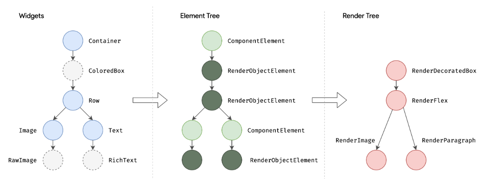

# 生命周期

`InheritedWidget`那些虚线框中的是只有引入了`InheritedWidget`触发了更新才会调用的。`setState`和`didUpdateWidget`都会触发`StatefulWidget`的`build`方法，实际上，页面重启和父组件调用`setState`都会触发`didUpdateWidget`重绘。

# 渲染原理
`Flutter`中的Widget并不是直接绘制在屏幕上的元素，而是根据widget转换，最终可渲染对象。当`Widget`属性发生变更的时候系统会创建新的，并替换原有的`Widget`，同时会触发创建新的Element`，并将新的插入到`Element Tree`中。

```
1. 根据Widget树生成Element树。Element树节点都继承自Element类
2. 根据Element树生成Render树（渲染树），渲染树节点都继承自RenderObject类
3. 根据渲染树生成Layer树，这个树是可以直接在屏幕上显示的。Layer中的节点全部继承自Layer类
```

# 源码
# 

```dart
@immutable
abstract class Widget extends DiagnosticableTree{
    // 控件独有：用来判断组件该创建还是更新，会在canUpdate中使用
    final Key? key;
    
    @protected
    @factory
    Element createElement()
}
```

```dart
// StatelessWidget源码：伪代码
abstract class StatelessWidget extends Widget{
    /* 构造函数 */
    StatelessElement createElement => StatelessElement(this);
}
```

```dart
// StatefulWidget
abstract class StatefulWidget extends Widget{
    /* 构造函数 */
    StatefulElement createElement() => StatefulElement(this);
    
    State createState();
}
```

从上面代码可以看出，`State`是单独维护的，所以不会出现组件`build`之后`State`还保留着。